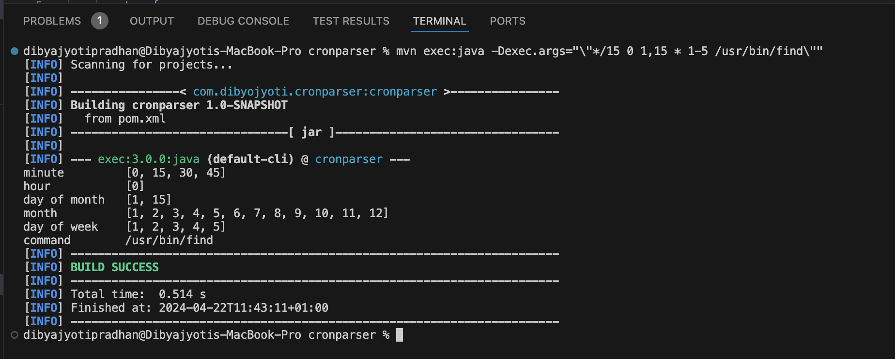
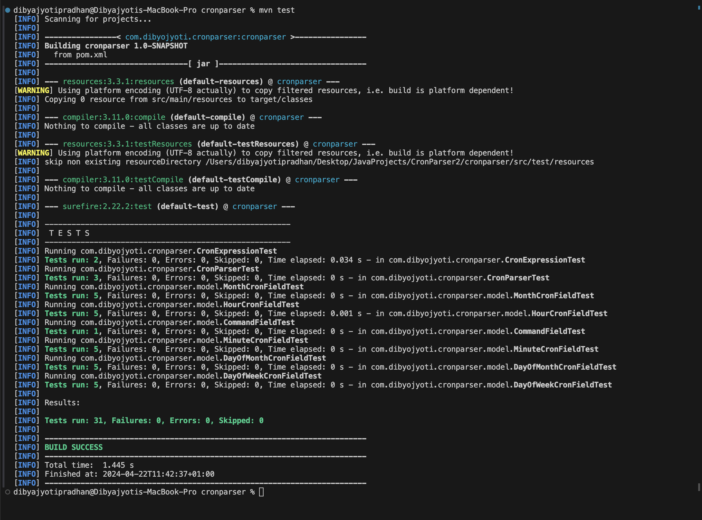

# Cron Expression Parser

## Introduction

This project implements a Cron Expression Parser in Java. It's designed to parse cron strings and expand each field to show the times at which it will run. The parser handles the standard cron format with five time fields (minute, hour, day of month, month, day of week) and a command.

## Task Description

The goal of this project is to implement a command-line application or script that parses a cron string and expands each field to show the times at which it will run. The requirements for this project are as follows:

- Use any language you feel comfortable with. In this case, Java has been used.
- Do **not** use existing cron parser libraries for this exercise. This is meant to demonstrate your ability to create your own implementation.
- Only consider the standard cron format with five time fields (minute, hour, day of month, month, day of week) plus a command. Special time strings like "@yearly" do not need to be handled.
- The cron string will be passed as a single argument to the application.
- The output should be formatted as a table with the field name taking the first 14 columns, followed by a space-separated list of the times.

Example input:

```
*/15 0 1,15 * 1-5 /usr/bin/find
```

Example output:

```
minute        0 15 30 45
hour          0
day of month  1 15
month         1 2 3 4 5 6 7 8 9 10 11 12
day of week   1 2 3 4 5
command       /usr/bin/find
```

You should spend no more than three hours on this exercise. If you don't have time to handle all possible cron strings, prioritize handling a subset correctly over implementing everything with errors. During the interview, you may be asked to extend this solution, so be ready to share your development environment for screen sharing.

Be sure to provide everything needed for a project reviewer to quickly ramp up, such as tests, a README (this file), and instructions for running the project in a clean OS X/Linux environment.

## Folder Structure

Here is the directory structure of the Cron Expression Parser project, outlining where the relevant files are located:

```
CronParserProject/
│
├── src/ # Contains all source code files
│ ├── main/
│ │ ├── java/
│ │ │ └── com/
│ │ │ └── dibyojyoti/
│ │ │ └── cronparser/
│ │ │ ├── model/ # Domain models
│ │ │ │ ├── CronField.java
│ │ │ │ ├── MinuteCronField.java
│ │ │ │ ├── HourCronField.java
│ │ │ │ ├── DayOfMonthCronField.java
│ │ │ │ ├── MonthCronField.java
│ │ │ │ ├── DayOfWeekCronField.java
│ │ │ │ └── CommandField.java
│ │ │ │
│ │ │ ├── CronExpression.java
│ │ │ └── CronParser.java # Main application class
```

## Setup

To set up and run the Cron Expression Parser, follow these steps:

1. **Install VSCode for Java:**  
   Ensure that you have VSCode installed with the necessary Java extensions. For installation instructions, visit [VSCode for Java](https://code.visualstudio.com/docs/languages/java#_install-visual-studio-code-for-java).

2. **Setup Maven:**
   ```
   brew install maven
   ```
3. **Open the Project:**  
   Open the `cronparser` folder in VSCode.

4. **Open a Terminal in VSCode:**  
   You can open a terminal in VSCode by going to `Terminal` -> `New Terminal`.

5. **Navigate to the Directory:(Check where is the root for pom.xml)**  
   Use the terminal to navigate to the `cronparser` directory:

   ```bash
   cd cronparser/
   ```

6. **Compile and run the Java code using the following command:**

   ```bash
   mvn exec:java -Dexec.args="\"*/15 0 1,15 * 1-5 /usr/bin/find\""
   ```

   Replace "\*/15 0 1,15 \* 1-5 /usr/bin/find" with any other cron expression as needed.

7. **Run test**
   ```bash
   mvn test
   ```

## Screenshots

Here are some screenshots that demonstrate the functionality of the Cookie Log Parser:




